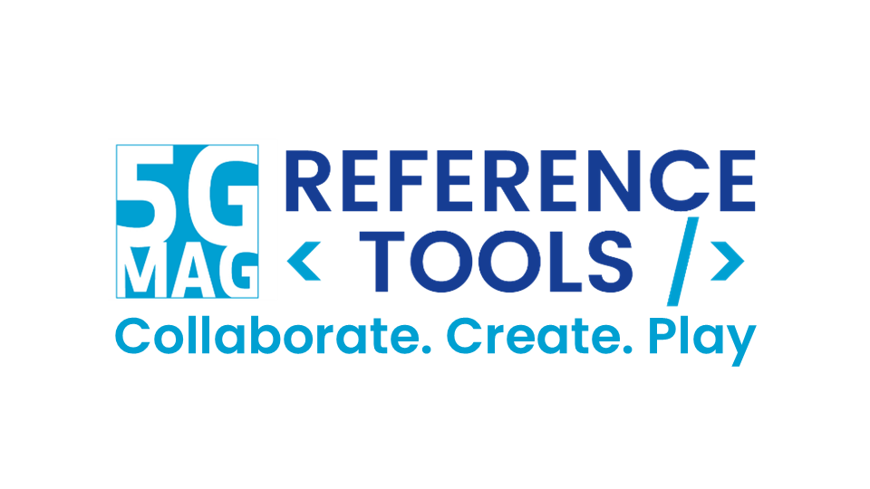
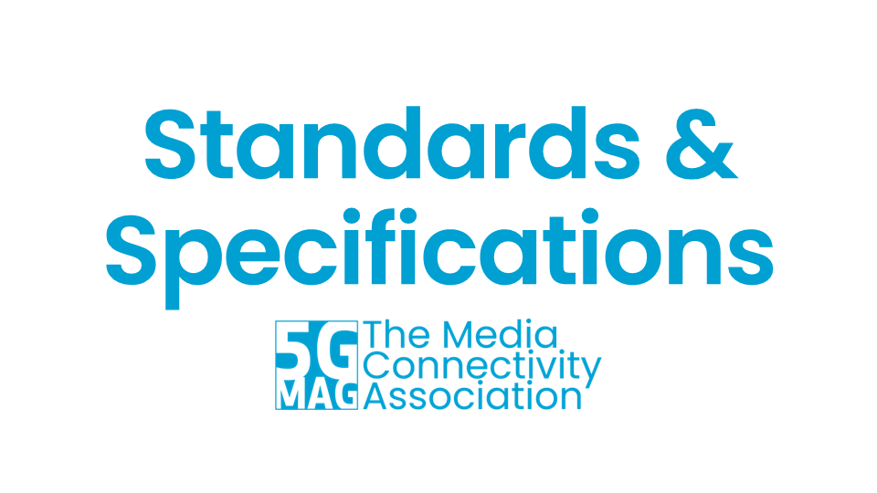

Through **5G-MAG's Hub**, you can access our **Technical Resources** and documentation, up-to-date information on **Standards** and all the resources of the **5G-MAG Reference Tools**.

<table>
  <tr>
    <td markdown="span" align="center"><a href="https://hub.5g-mag.com/Getting-Started/"><a/></td>
    <td markdown="span" align="center"><a href="https://hub.5g-mag.com/Tech/"><a/></td>
  </tr>
  <tr>
    <td markdown="span" align="center">[5G-MAG Reference Tools](https://hub.5g-mag.com/Getting-Started/){: .btn .btn-blue }</td>
    <td markdown="span" align="center">[Technical Documentation](https://hub.5g-mag.com/Tech/){: .btn .btn-blue }</td>
  </tr>
    <td> </td>
  <tr>
    <td markdown="span" align="center"><a href="https://hub.5g-mag.com/Standards/"><a/></td>
    <td markdown="span" align="center"><a href="https://github.com/orgs/5G-MAG/discussions"><a/></td>
  </tr>
  <tr>
    <td markdown="span" align="center">[Standards](https://hub.5g-mag.com/Standards/){: .btn .btn-blue }</td>
    <td markdown="span" align="center">[Discussions](https://github.com/orgs/5G-MAG/discussions){: .btn .btn-blue }</td>
  </tr>
</table>

---

### Go to: [https://hub.5g-mag.com/Tech/](https://hub.5g-mag.com/Tech/)

The <b>Tech</b> section contains the following types of resources:
<ul>
  <li><strong>Architectures and Workflows:</strong> Detailed descriptive pages and diagrams that break down how different components interact.</li>
  <li><strong>Technical Explainers:</strong> High-level summaries designed to simplify complex specifications for a broader audience.</li>
  <li><strong>Operational Parameters and Profiles:</strong> Specific technical data and configurations required for deployment.</li>
  <li><strong>Analysis Reports:</strong> Documentation covering the feasibility and requirements of emerging technologies.</li>
  <li><strong>Presentation Materials:</strong> Downloadable slide decks and overview documents that provide a baseline understanding of our technical topics.</li>
  <li><strong>Video Resources:</strong> Links to recorded public calls that walk through a particular technology or feature.</li>
</ul>

---

### Go to: [https://github.com/orgs/5G-MAG/discussions](https://github.com/orgs/5G-MAG/discussions)

Open discussions on technology and software related topic.

---

### Go to: [https://hub.5g-mag.com/Standards/](https://hub.5g-mag.com/Standards/)

The <b>Standards</b> section contains the following types of resources:
<ul>
  <li><strong>Requirements and Member Inputs:</strong> Consolidated documents detailing technical requirements and contributions submitted by 5G-MAG members to various SDOs.</li>
  <li><strong>Liaison Statements:</strong> A collection of official communications and informative documents used to exchange information and coordinate work with external standardization bodies.</li>
  <li><strong>Specification Feedback:</strong> Access to dedicated tracking for feedback and bug reporting on existing specifications, often informed by insights gained during software development and real-world deployment.</li>
  <li><strong>Standards Trackers and Work Item Lists:</strong> Organized lists and summaries of relevant 3GPP work items categorized by release, allowing users to track the evolution of specific media-related features.</li>
</ul>

---

### Go to: [https://hub.5g-mag.com/Getting-Started/](https://hub.5g-mag.com/Getting-Started/)

The <b>Getting-Started</b> section contains the following types of resources (click to expand)

  
<ul>
  <li><strong>Software Repositories and Source Code:</strong> Direct access to the code hosted on GitHub for various reference tools, enabling developers to build, test, and contribute software.</li>
  <li><strong>Project Roadmaps and Releases:</strong> Detailed tracking of software development and the latest releases of different software projects.</li>
  <li><strong>Architecture and Scope Overviews:</strong> High-level technical architectures and summaries that define the functional components of software projects.</li>
  <li><strong>Feature Mapping:</strong> Detailed lists of supported technical features and extensions implemented within the reference tools, showing the current level of alignment with industry standards.</li>
  <li><strong>Step-by-Step Tutorials:</strong> Practical, "hands-on" guides and developer-led walkthroughs (including audiovisual content) that assist in setting up environments and running reference implementations.</li>
  <li><strong>Configuration and Sample Files:</strong> A collection of necessary assets for testing, such as sample media files, Docker configuration scripts, and service announcement examples to facilitate quick deployment.</li>
  <li><strong>Contributor Guidelines:</strong> Documentation providing structured instructions on how developers and organizations can contribute code, report bugs, and participate in the developer community.</li>
</ul>

---

Enjoy! 💪
